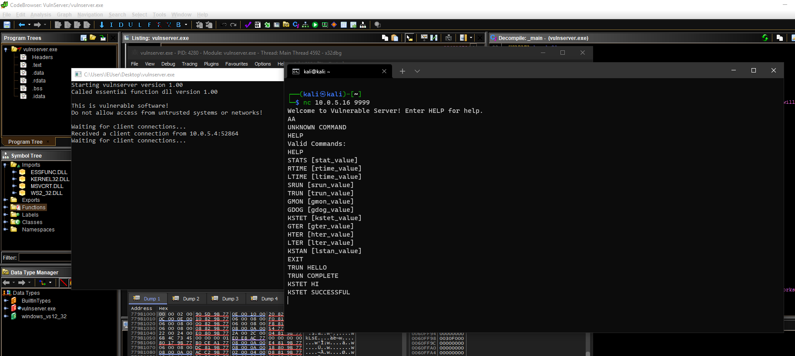
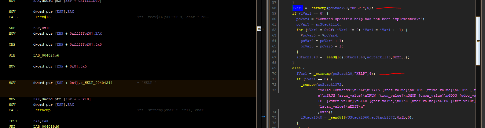
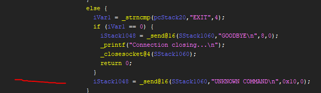
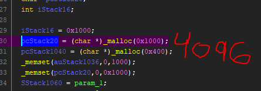
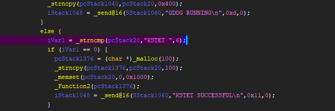
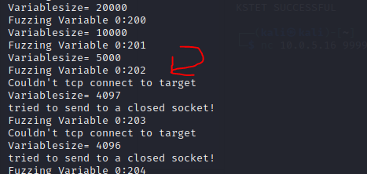

# VulnServer

# Tools:
* Python
* Spike
* Ghidra
* x64 Debbugger

# Lessons
Make sure the Fuzzer has the right parameters. I could not crash the program via spike until I reviewed the links:  [SAMS](https://samsclass.info/127/proj/p16-spike.htm) [INFOSEC](https://resources.infosecinstitute.com/topic/intro-to-fuzzing/)

# Network Analysis:
VulnServer is known to be vulnerable. While the source code is available to view, I wanted to learn Ghidra and reverse engineering concepts.
The first step was running the program. Fortunately VulnServer had console output.
In the event that this application did not reveal which port number the server is running(no arg supplied) there are a couple of options.
* NetStat
* WireShark
* NMAP
* Ghidra(disassemble the file and see if there's a string/number) 

  A Reverse Engineer can view a programs imports and see if networking libraries are used. According to MSDN "The Ws2_32.dll loads the service provider's interface DLL into the system...This is typically triggered by an application calling either socket or WSASocket to create a new socket" This indicates that sockets may be used. The mswsock library was also used(dynamically). Mswsock = Windows Sockets 2.

# Fuzzing:
I am testing two commands that cause VulnServer to crash TRUN & KSTET.  I haven't fuzzed other commands. 

# Binary Analysis:
Lets say VulnServer crashes why did it crash and is the crash exploitable? 
Disclaimer: there may be some <b>mistakes</b>. 
Connecting to our target we realize there should be multiple strings. Fortunately they are inside the binary. 
The vulnerable functions that crashes during the fuzzing were TRUN & KSTET. Lets look at the strings. 
While the strings are stored in .rdata their cross-reference location function's revealed. 
I found the main programs logic using the HELP command. If a user enters HELP an if-statement is executed. 
If you enter "help" the output is UNKNOWN COMMAND. If you enter HELP various commands are displayed.
 Note:It's easier to navigate the assembly with a combination of decompiler.(The symbol tree did not show the function with main logic)
I only found the Undefined function with strings and the xref location in .rdata.

   Now that we found the vulnerable function's entry point lets analyze it.

# Vulnerability:
KSTET is a vulnerable component in VulnServer. 
Running spike fuzzer against the server crashes it. 
Viewing KSTET in Ghidra reveals no bounds checking. 
In the else statement caluse strncmp has no bounds checking for the passed input. 
The variable has 4096 bytes of space. Since we're passing a string "\n" is also added. This triggers the crash!

# POC:

# Exploit:
